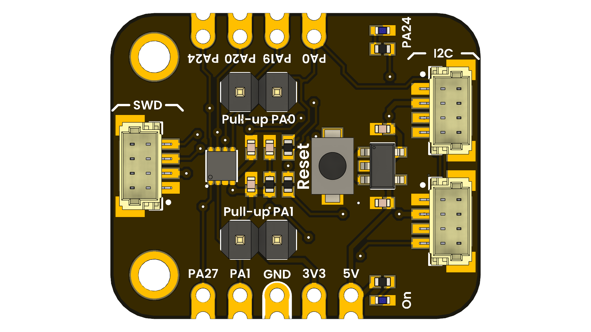

# DevLab: MSPM0C1104SDSGR MCU Dev Board

## Introduction

The MSPM0C1104SDSGR Devlab is a compact development board featuring the microcontroller ARM Cortex-M0+ MSPM0C1104SDSGR. This board is designed for developers and hobbyists to prototype and test applications with ease.

  
  
  
  
   

  
  
<em>MSPM0C1104SDSGR Devlab</em>

### Quick Setup

## Overview

| Feature               | Description                                         |
|-----------------------|-----------------------------------------------------|
| Microcontroller       | ARM Cortex-M0+ MSPM0C1104SDSGR                      |
| Operating Voltage     | 1.8V to 3.6V                                        |
| Flash Memory          | 16KB                                                |
| RAM                   | 4KB                                                 |
| Communication         | I2C, SPI, UART                                      |
| GPIO Pins             | 8                                                 |

## Applications

- Embedded Systems Development
- IoT Prototyping
- Educational Purposes
- Sensor Interfacing
- Home Automation Projects
- Robotics Control Systems

## License

This product and its documentation are licensed under the MIT License.  
See [`LICENSE.md`](LICENSE.md) for details.

  Template by UNIT Electronics • Customize this file for your product documentation.

