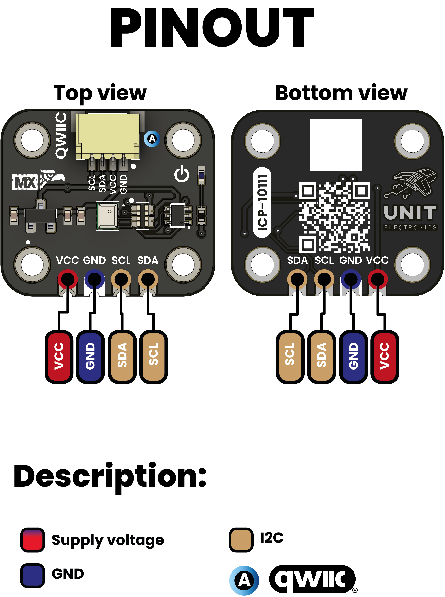
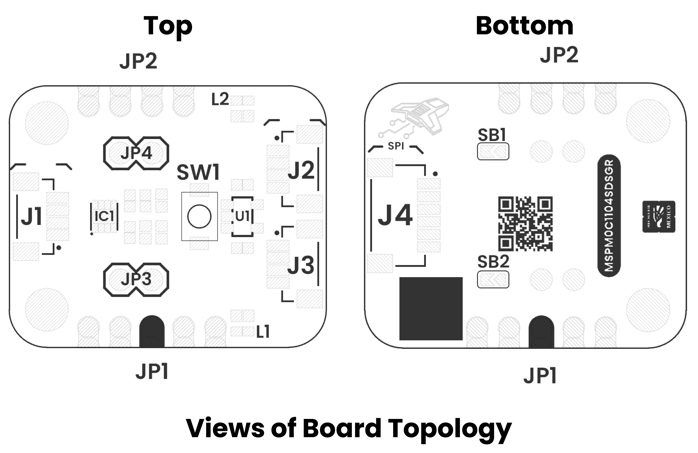
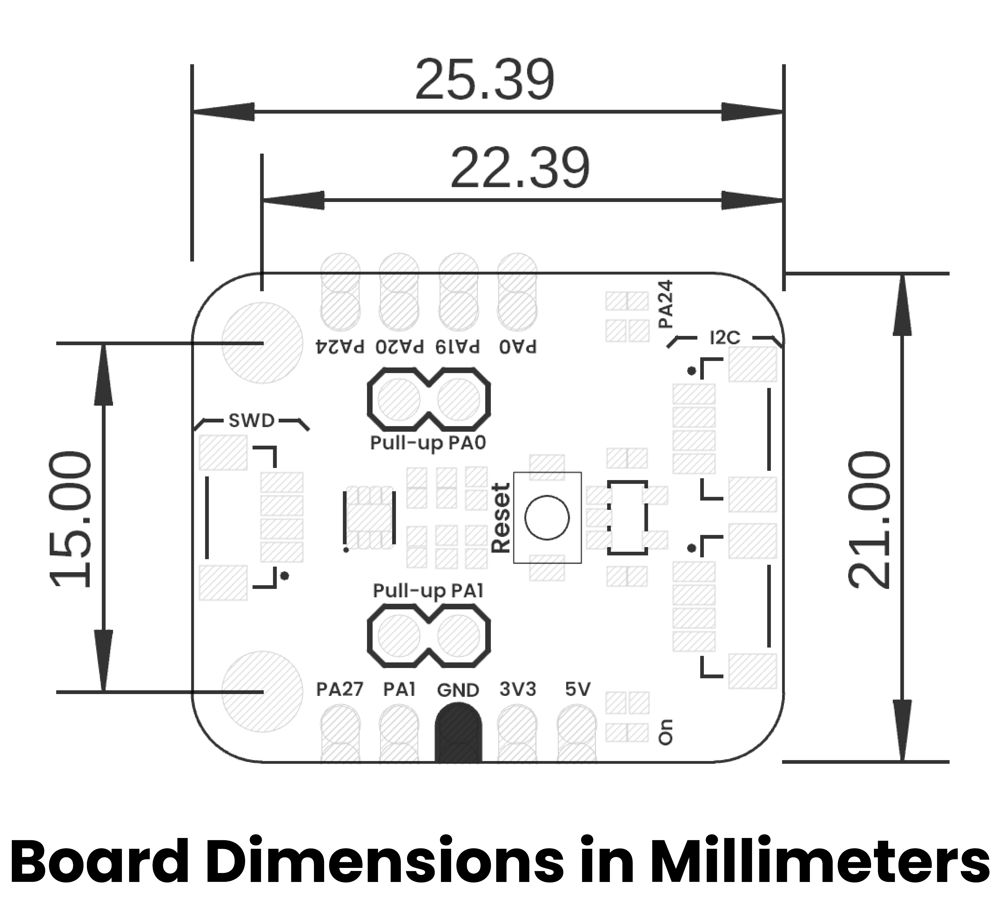

# Hardware

<a href="./unit_sch_V_0_0_1_ue0104_mspm0c1104sdsgr_devlab.pdf"> Schematic</a>

## Electrical characteristics

| **Parameter** |                 **Description**                  | **Min** | **Typ** | **Max** | **Unit** |
|:-------------:|:------------------------------------------------:|:-------:|:-------:|:-------:|:--------:|
|      Vcc      |       Input voltage to power on the module       |   2.5   |    -    |   5.5   |    V     |
|      Vdd      |  Input voltage to power on the microcontroller   |  1.62   |    -    |   3.6   |    V     |
|     Ivcc      | Current flowing into Vdd pin of microcontroller  |    -    |    -    |   100   |    mA    |
|     I3v3*     |         Maximum current of 3V3 regulator         |    -    |    -    |   80    |    mA    |
|  Iio (SDIO)   |       Current sunk or sourced by SDIO pin        |    -    |    -    |    6    |    mA    |
|  Iio (ODIO)   |       Current sunk or sourced by SDIO pin        |    -    |    -    |   20    |    mA    |
|  Vih (ODIO)   |   Input high level voltage at 5V tolerant pins   |    2    |    -    |   5.5   |    V     |
|      Vih      | Input high level voltage (except ODIO and Reset) | 0.7*Vin |    -    | Vin+0.3 |    V     |
|  Vil (ODIO)   |   Input low level voltage at 5V tolerant pins    |  -0.3   |    -    |   0.8   |    V     |
|      Vil      | Input low level voltage (except ODIO and Reset)  |  -0.3   |    -    | 0.3*Vin |    V     |
|      Voh      | Output high level voltage at standard-drive pins | Vin-0.5 |    -    |    -    |    V     |
|  Vol (ODIO)   |   Output low level voltage at 5V tolerant pins   |    -    |    -    |   0.5   |    V     |
|      Vol      | Output low level voltage at standard-drive pins  |    -    |    -    |   0.4   |    V     |
|  fmax (ODIO)  |    Port output frequency at 5V tolerant pins     |    -    |    -    |    1    |   MHz    |
|  fmax (SDIO)  |   Port output frequency at standard-drive pins   |    -    |    -    |   24    |   MHz    |

*Optimal thermal management is required for the regulator to perform reliably at maximum output current.

## 🔌 Pinout

    <a href="#"> Pinout</a>
     
     
     

    
## Pin & Connector Layout

| Pin   | Voltage Level | Function                                                  |
|-------|---------------|-----------------------------------------------------------|
| VCC   | 3.3 V – 5.5 V | Provides power to the on-board regulator and sensor core. |
| GND   | 0 V           | Common reference for power and signals.                   |
| SDA   | 1.8 V to VCC  | Serial data line for I²C communications.                  |
| SCL   | 1.8 V to VCC  | Serial clock line for I²C communications.                 |

> **Note:** The module also includes a Qwiic/STEMMA QT connector carrying the same four signals (VCC, GND, SDA, SCL) for effortless daisy-chaining.

## 📃 Topology

<a href="./resources/unit_topology_V_0_0_1_ue0104_mspm0c1104sdsgr_devlab.png">  Topology</a>
 
 
 

| Ref. | Description                               |
|------|-------------------------------------------|
| IC1  | MSPM0C1104SDSGR                           |
| L1   | Power On LED                              | 
| L2   | Built In LED at PA24                      |
| U1   | AP2112K 3V3 Regulator                     | 
| JP1  | 2.54 mm Castellated Holes                 |
| JP2  | 2.54 mm Castellated Holes                 |
| JP3  | 2.54 mm Headers                           |
| JP4  | 2.54 mm Headers                           |
| J1   | JST 1 mm pitch for SWD                    |
| J2   | QWIIC Connector (JST 1 mm pitch) for I2C  |
| J3   | QWIIC Connector (JST 1 mm pitch) for I2C  |
| J4   | JST 1 mm pitch for SPI                    |
| SW1  | Reset Push Button                         | 
| SB1  | Solder Bridge for LED Built In Enable     |
| SB2  | Solder Bridge for Reset Push Button Enable|

## 📏 Dimensions

<a href="./resources/unit_dimensions_V_0_0_1_ue0104_mspm0c1104sdsgr_devlab.png">  Dimensions</a>

# References

- <a href="https://www.ti.com/lit/ds/symlink/mspm0c1104.pdf?ts=1762978469851&ref_url=https%253A%252F%252Fwww.ti.com%252Fsitesearch%252Fen-us%252Fdocs%252Funiversalsearch.tsp%253FlangPref%253Den-US%2526nr%253D1793%2526searchTerm%253DMSPM0C1104">MSPM0C110x Datasheet </a>
